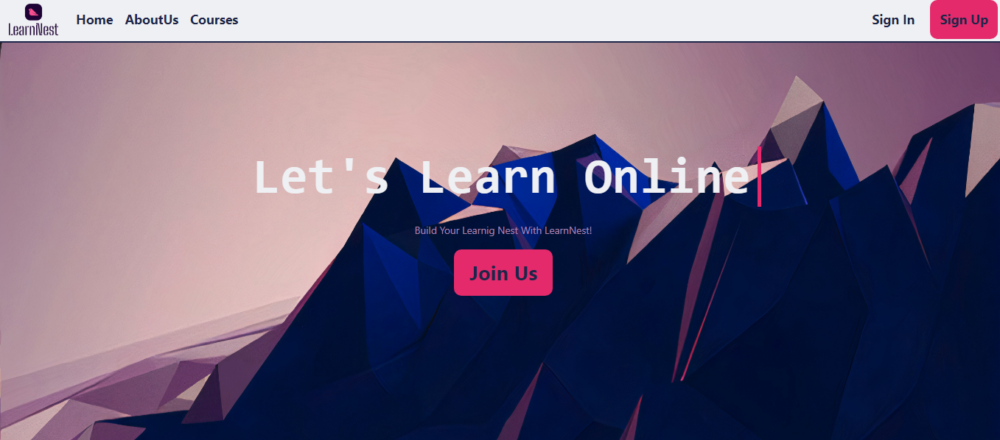

# Online Learning Platform


## Introduction

LearnNest is a web application designed to facilitate online education. The platform allows course providers to create and manage courses, while learners can browse, enroll in, and track their progress through a variety of courses. You can become a Course Provider too and add your own courses for users to see and take.

Poject Deployed Version:

Project's Blog: 

 author LinkedIn: https://www.linkedin.com/in/eman-tamam-47a2a9241/

## Table of Contents

- [Features](#features)
- [Technologies Used](#technologies-used)
- [Setup and Installation](#setup-and-installation)
- [Usage](#usage)
- [Contributing](#Contributing)
- [Related projects](#Relatedprojects)
- [License](#license)

## Features

- User registration and authentication
- Course provider functionality to create and manage courses
- Course browsing and enrollment for learners
- Learning progress tracking
- Responsive design for seamless use on different devices

## Technologies Used

- **ASP.NET Core (.NET 6)** – Backend framework for web application development
- **Microsoft SQL Server** – Database for storing user, course, and enrollment data
- **HTML, CSS, JavaScript** – Frontend technologies for user interface design
- **Entity Framework Core** – ORM for data access
- **Bootstrap** – For responsive design

## Installation

1. Clone the repository:

   ```bash
   git clone https://github.com/Eman288/Online-Learning-Platform.git
   cd Online-Learning-Platform
   ```

2. Open the solution in Visual Studio.

3. Configure the database connection string in `appsettings.json`:

   ```json
   {
     "ConnectionStrings": {
       "DefaultConnection": "Server=your-server;Database=OnlineLearning;Trusted_Connection=True;MultipleActiveResultSets=true"
     }
   }
   ```

4. Run the following commands to apply migrations and update the database:

   ```bash
   dotnet ef database update
   ```

5. Build and run the application:

   ```bash
   dotnet run
   ```

## Usage

- **Course Providers** can log in to create, edit, and manage their courses.
- **Learners** can browse available courses, enroll, and track their learning progress.



## Contributing

At this stage, the project has been developed individually. However, contributions are welcome! If you have suggestions, bug reports, or would like to contribute to the project, feel free to fork the repository and submit a pull request.

To contribute:

Fork the repository.
Create a new branch (git checkout -b feature-branch).
Make your changes and commit (git commit -m 'Add new feature').
Push to the branch (git push origin feature-branch).
Open a Pull Request for review.

## Related Projects

Here are a few related open-source projects that might interest you:

- [Moodle](https://github.com/moodle/moodle) – An open-source LMS with a wide range of tools for online learning.
- [Open edX](https://github.com/edx/edx-platform) – A platform for hosting and managing online courses.

## License

This project is licensed under the MIT License. See the [LICENSE](LICENSE) file for more details.
